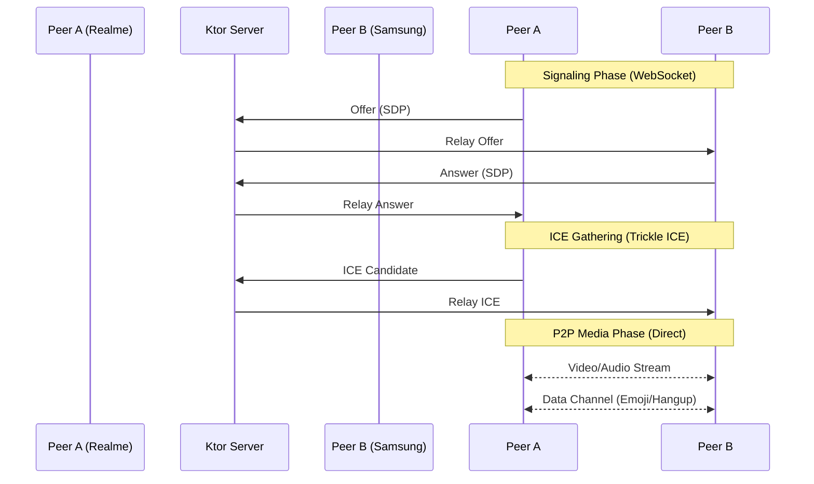

# WebRTC Video Call & Ktor Signaling Monorepo

[](https://developer.android.com/android)
[](https://ktor.io/)
[](https://webrtc.org/)

A production-grade WebRTC implementation featuring a high-performance **Ktor-based signaling server** and a modern **Android client** built with Jetpack Compose, Clean Architecture, and Kotlin Coroutines.

---

## 🏗 System Architecture

This project follows a **Monorepo** structure, ensuring that the signaling protocols and data models between the client and server remain perfectly synchronized.



---

## 🚀 Technical Highlights

### 🛡 Perfect Negotiation Pattern
Implemented the **"Polite/Impolite"** peer pattern to handle **Glare** (signaling collisions). By assigning roles based on User ID tie-breaking, the app gracefully handles asynchronous renegotiation (e.g., adding a screen share track or switching cameras) without state corruption.

### ⚡ WebRTC Data Channels
Leverages direct P2P data pipes for low-latency non-media signaling:
- **Zero-Latency Hangup**: Call termination is synchronized via P2P data channels to prevent "frozen screen" artifacts.
- **Interactive Emoji Chat**: High-speed, direct peer-to-peer emoji transfer for a reactive user experience.

### 📊 Media Optimization (QoS)
- **Bitrate Capping**: Outgoing streams are limited to **2Mbps** to ensure stability on varying mobile networks.
- **Degradation Preference**: Configured to `MAINTAIN_FRAMERATE`. The engine prioritizes fluid 30fps motion over resolution during bandwidth drops.
- **Adaptive Bitrate (ABR)**: Real-time quality adjustment using Google Congestion Control (GCC).

### 📱 Android Clean Architecture
- **UI**: 100% Jetpack Compose with reactive state-driven components.
- **Signaling Layer**: Uses **Kotlin SharedFlow** for a reactive, thread-safe message stream.
- **Resource Management**: Fully lifecycle-aware WebRTC engine disposal to prevent memory leaks and camera lock-ups.

---

## 📦 Project Structure

```text
.
├── app/                  # Android Front-end Application
│   ├── src/main/java     # Clean Architecture implementation
│   └── src/main/res      # Compose UI resources
└── signaling-server/     # Ktor Signaling Back-end
    └── src/main/kotlin   # WebSocket routing and participant registry
```

---

## 🏃 Getting Started

### 1. Start the Signaling Server
1. Navigate to the `signaling-server` directory.
2. Run the server using Gradle:
   ```bash
   ./gradlew run
   ```
3. The server will start on `0.0.0.0:8887`.

### 2. Run the Android App
1. Build and install the app on two physical devices (Realme & Samsung).
2. Ensure both are on the **same WiFi network** as your computer.
3. Tap the **Pencil icon** in the app header and enter your computer's local IP.
4. Set the **Room ID** to be identical on both devices.
5. Tap **"Start Call"** on one phone and **"Accept"** on the other.

---

## 🔍 Troubleshooting

- **Connection Failure**: Verify that your computer's Firewall allows incoming TCP connections on port `8887`.
- **Camera Issues**: Ensure you have granted Camera and Microphone permissions on both devices.
- **Logging**: Filter Logcat with tags `WebRTC-SIG` (signaling) and `WebRTC-Session` (media) for deep debugging.

---

## 📝 License
MIT License - Feel free to use this for professional interviews or learning purposes.
